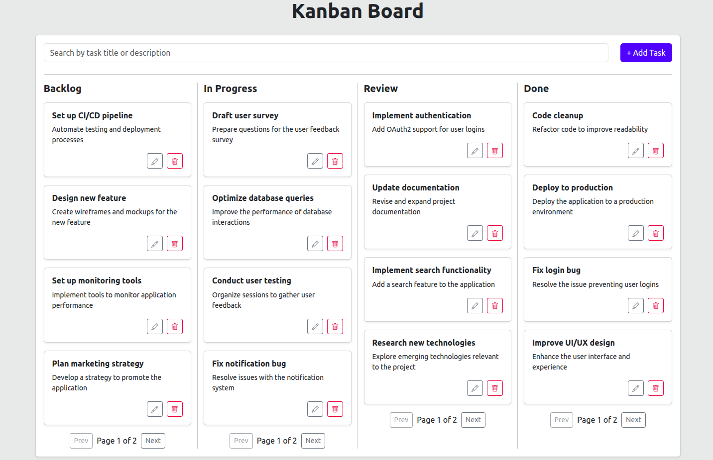

# Kanban-style To-Do List Dashboard


A modern Kanban-style to-do list dashboard with drag-and-drop, built with React, TypeScript, Vite, and json-server for a mock API.

## 🚀 Live Demo

[View Deployed App](https://kanban-style-to-do-list-dashboard.vercel.app)

---

## Features

- Kanban board with columns: Backlog, In Progress, Review, Done
- Add, edit, delete tasks
- Drag and drop tasks between columns
- Search tasks by title or description (with debounce)
- Responsive and modern UI (Bootstrap)
- Data persistence via json-server (REST API)

---

## 🛠️ Getting Started

### 1. Clone the repository

```bash
git clone https://github.com/saeedkhal/Kanban-style-To-Do-List-Dashboard-.git
cd Kanban-style-To-Do-List-Dashboard-
```

### 2. Install dependencies

```bash
npm install
```

### 3. Start the mock API (json-server)

```bash
npx json-server --watch db.json --port 4000
```

### 4. Start the development server

```bash
npm run dev
```

- The app will be available at `http://localhost:5173` (or as shown in your terminal)
- The API will be available at `http://localhost:4000/tasks`

---

## 🖱️ Drag and Drop

- Drag a task card and drop it into another column to change its status.
- All changes are persisted to the mock API.

---

## 📂 Project Structure

- `src/` — React app source code
- `db.json` — Mock database for json-server
- `public/` — Static assets (including app image)

---

## 📸 App Screenshot



---

## 🤝 Contributing

Pull requests are welcome! For major changes, please open an issue first to discuss what you would like to change.

---

## 📄 License

[MIT](LICENSE)